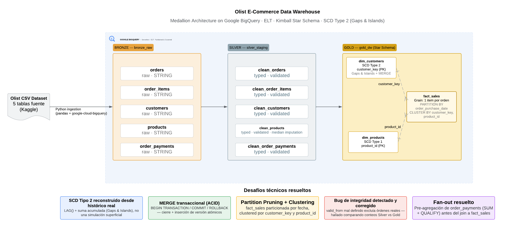

# Olist E-Commerce — Medallion Architecture Data Warehouse (BigQuery)

Pipeline de datos completo sobre el dataset público de [Olist Brazilian E-Commerce](https://www.kaggle.com/datasets/olistbr/brazilian-ecommerce), implementando una arquitectura Medallion (Bronze → Silver → Gold) en Google BigQuery, con un Star Schema en la capa Gold que incluye **Slowly Changing Dimensions Tipo 2** reconstruidas desde evidencia histórica real usando el patrón **Gaps and Islands**.

Este proyecto es la evolución en cloud/ELT de un pipeline ETL original construido en PostgreSQL ([Proyecto 1](#)), aplicando conceptos de Data Warehousing, modelado dimensional y arquitectura Lakehouse.

---

## Arquitectura



| Capa | Propósito | Patrón |
|---|---|---|
| **Bronze** | Copia cruda e inmutable de la fuente, con metadata de ingesta | Todo como `STRING`, sin transformar |
| **Silver** | Datos tipados, limpios, deduplicados, validados | ELT (transformación dentro de BigQuery) |
| **Gold** | Star Schema listo para consumo analítico | Kimball dimensional modeling |

## Tech stack

- **Google BigQuery** — motor de datos, serverless, particionado y clustering nativo
- **Python** (`google-cloud-bigquery`, `pandas`) — ingesta Bronze
- **GoogleSQL** — transformaciones Silver/Gold, `MERGE` transaccional, funciones de ventana
- **BigQuery Scripting** (`BEGIN...END`, `BEGIN TRANSACTION`) — atomicidad en cargas incrementales

## ¿Por qué BigQuery?

Serverless (sin gestión de clústeres), sandbox gratuito para desarrollo, y ampliamente solicitado (junto con Snowflake/Redshift) en vacantes de Data Engineer en el mercado mexicano. La lógica de `MERGE`/SCD implementada aquí es directamente transferible a Snowflake, cuya sintaxis de `MERGE` es prácticamente idéntica.

---

## Modelo dimensional (Gold Layer)

### `dim_customers` — SCD Type 2

- **Natural key:** `customer_unique_id` (no `customer_id` — en Olist, `customer_id` es único **por orden**, no por cliente; es una medida de anonimización documentada del dataset).
- **Surrogate key:** `customer_key`, generado con `ROW_NUMBER()`.
- **Historial reconstruido desde datos crudos**, no simulado: se detectan cambios reales de ciudad entre órdenes consecutivas del mismo cliente usando `LAG()` + suma acumulada (**patrón Gaps and Islands**), generando una fila por cada versión histórica genuina con su rango `[valid_from, valid_to)`.
- Carga incremental vía `MERGE` + `INSERT` envueltos en una transacción explícita (`BEGIN TRANSACTION` / `COMMIT` / `ROLLBACK`) para garantizar atomicidad entre el cierre de la versión vieja y la inserción de la nueva.

### `dim_products` — SCD Type 1

- Atributos estáticos para este análisis; corrección por sobrescritura, sin historial.
- Usa `product_id` directamente como llave — un surrogate key es innecesario cuando no hay múltiples versiones que desambiguar.

### `fact_sales` — Transaction fact table

- **Grano:** una fila = un item dentro de una orden.
- **Particionada por `order_purchase_date`**, clustered por `customer_key, product_id`.
- `order_id` vive como *degenerate dimension* (columna directa, sin tabla propia).
- El `JOIN` contra `dim_customers` resuelve el `customer_key` **vigente en la fecha exacta de cada orden** — no el más reciente — preservando la corrección histórica que da sentido a un SCD Tipo 2.

---

## Desafíos técnicos y decisiones de diseño

Esta sección documenta problemas reales encontrados durante la construcción — y cómo se resolvieron — más que un pipeline que "funcionó a la primera".

**1. `valid_from` mal definido en la primera versión de `dim_customers`.**
La carga inicial derivaba `valid_from` de la fecha de la orden *más reciente* del cliente (reutilizando el mismo criterio usado para elegir sus atributos actuales). Esto excluía silenciosamente órdenes legítimas y anteriores del `JOIN` de vigencia en `fact_sales`, porque su fecha caía *antes* del propio `valid_from` de la única versión existente. Detectado comparando conteos de filas entre `clean_order_items` y `fact_sales` por orden.

**2. Simulación vs. reconstrucción real del historial SCD2.**
El plan inicial era simular manualmente un cambio de cliente para probar el `MERGE`. Al investigar si el dataset ya contenía clientes con múltiples ciudades registradas, se confirmó que sí — la carga inicial estaba **colapsando historial real** a una sola fila por cliente. Se reconstruyó `dim_customers` con el patrón Gaps and Islands (`LAG()` + suma acumulada con `ROWS BETWEEN UNBOUNDED PRECEDING AND CURRENT ROW`) para generar una versión por cada tramo real de ciudad constante, en vez de depender solo de cambios simulados.

**3. Fan-out por relación 1-a-muchos con `order_payments`.**
Una orden puede tener múltiples métodos de pago (ej. tarjeta + voucher) en Olist. Unir `order_payments` directamente contra `order_items` multiplicaba filas del grano deseado. Resuelto pre-agregando `order_payments` a grano "una fila por orden" (`SUM() OVER` + `QUALIFY ROW_NUMBER() = 1`) antes del join principal.

**4. Precedencia de operadores en condición de vigencia SCD.**
Una condición `WHERE fecha >= valid_from AND fecha < valid_to OR valid_to IS NULL` sin paréntesis explícitos evaluaba el `OR` de forma independiente al filtro de fecha (por precedencia de `AND` sobre `OR`), permitiendo que *cualquier* orden hiciera match con la versión vigente del cliente sin importar su fecha real.

---

## Estructura del repositorio

```
layers/
├── 01_bronze/
│   └── load_to_bronze.py          # Ingesta CSV → BigQuery (Python)
├── 02_silver/
│   └── silver_transformations.sql # Limpieza, tipado, validación de conteos
└── 03_gold/
    ├── dim_customers_scd2.sql     # Reconstrucción SCD2 (Gaps and Islands)
    ├── scd2_merge_incremental.sql # MERGE transaccional para cargas incrementales
    ├── dim_products.sql
    └── fact_sales.sql             # Particionada + clustered
docs/
└── architecture-diagram.md
```

## Cómo ejecutar

1. Crear 3 datasets en BigQuery en la misma región: `bronze_raw`, `silver_staging`, `gold_dw`.
2. Configurar credenciales (`gcloud auth application-default login`) y ajustar `PROJECT_ID` en `load_to_bronze.py`.
3. Ejecutar en orden: `load_to_bronze.py` → `silver_transformations.sql` → `dim_customers_scd2.sql` → `dim_products.sql` → `fact_sales.sql`.
4. Para simular cambios incrementales de cliente, insertar filas en `gold_dw.stg_customer_changes` y ejecutar `scd2_merge_incremental.sql`.

## Alcance y trabajo futuro

- **`fact_refunds`**: no implementado. Olist no incluye un evento de reembolso explícito en el dataset (solo estados de orden como `canceled`/`unavailable`, y estos quedan excluidos por el filtro de `clean_orders`); modelarlo correctamente requeriría una tabla Silver adicional sin ese filtro.
- **Concurrencia en generación de `customer_key`**: el patrón `MAX(customer_key) + ROW_NUMBER()` no es seguro ante escrituras concurrentes (condición de carrera). Válido para cargas controladas/secuenciales; en un pipeline orquestado (Airflow) con posible concurrencia real se recomendaría `GENERATE_UUID()` o una secuencia atómica del motor.

## Dataset

[Olist Brazilian E-Commerce Public Dataset](https://www.kaggle.com/datasets/olistbr/brazilian-ecommerce) (Kaggle).